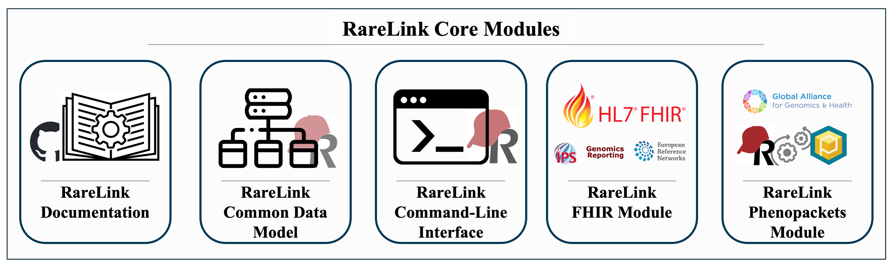

.. _2_1: 

RareLink Overview
=================

.. tip:: 
   - **Manuscript:** RareLink was recently published in npj Genomic Medicine: https://www.nature.com/articles/s41525-025-00534-z

RareLink aims to maximise the utility of REDCap by providing a comprehensive 
framework designed specifically for rare disease (RD) research and care. 
At the core of RareLink is this documentation, the RareLink instruments that are 
based on the :ref:`1_5`, its user guides and the 
surrounding preconfigured pipelines and software architecture. This framework 
ensures that data capture is both consistent and compliant with HL7 FHIR and 
GA4GH Phenopackets, without the need for additional coding or mapping. 
As a result, RareLink allows researchers and clinicians to collect and process
RD data seamlessly within the REDCap environment.

.. figure:: ../_static/res/rarelink_overview.svg

    Overview of the RareLink framework integrated with a local REDCap instance. 
    The framework comprises the RareLink instruments based on the RD-CDM, the 
    RareLink API, the toFHIR & CDIS module for export and import to HL7 FHIR IPS
    and Genomic Reporting Resources, and the RareLink-Phenopackets module for 
    direct export to GA4GH Phenopackets. Additionally, the LinkML-based import 
    mapper facilitates data import from tabular databases into REDCap, while 
    the Manual Data Capture Guide assists with the manual data capture of 
    RD-CDM data in a local REDCap project. Click `here <https://github.com/BIH-CEI/rarelink/blob/develop/docs/_static/res/rarelink_overview.svg>`_ 
    to see the figure in full size.

.. note:: 
    You will need your own REDCap instance to deploy the RareLink framework.
    See the :ref:`3_2` for more information.
_____________________________________________________________________________________

RareLink Framework components
-----------------------------

    Overview of the five RareLink core RareLink modules.

_____________________________________________________________________________________

Semi-Automatic Import
______________________

    In many Rare Disease specialised centres, registries or hospitals, data is 
    stored in tabular databases (e.g. Excel). RareLink's Import Mapper that is 
    utilising the `Phenopacket Mapper <https://bih-cei.github.io/phenopacket_mapper/latest/index.html>`_ 
    API can be used to convert and import data from these databases into the 
    REDCap RareLink format and your local REDCap project.

    .. admonition:: Continue here...

        - Guide for the :ref:`3_4`.
        - User guide for :ref:`4_2`.

_____________________________________________________________________________________

Manual Data Capture
___________________

    RareLink provides a preconfigured data collection sheets based on the :ref:`1_5`
    and user guides for manual data capture to ensure precision and correctness
    of data captured. Further, RareLink defines guidelines for developing more 
    specialised REDCap sheets around the RD-CDM so that the data captured can 
    also be processed by our framework to generate FHIR Resources and Phenopackets. 

    .. admonition:: Continue here...

        - Guide to install the :ref:`3_1`.
        - Guide to develop the :ref:`3_2`.
        - User guide for :ref:`4_1`.

_____________________________________________________________________________________

Local REDCap Project Setup and API
__________________________________

    RareLink is designed to be deployed and installed in a local REDCap instance. 
    Using the guidelines provided, or using our preconfigured RareLink-REDCap and 
    setting up the RareLink API, you can ensure that the data captured is compliant
    with the our framework to generate FHIR Resources and Phenopackets.

    .. admonition:: Continue here...
        
        - How to :ref:`3_3`.
        - How to deploy and :ref:`3_4`.
    
_____________________________________________________________________________________

RareLink & Phenopackets
_______________________

    RareLink utilises the Phenopacket Mapper to convert the data captured in
    REDCap into Phenopackets. The RD-CDM and the corresponding RareLink
    instruments are preconfigured within our GitHub repository to generate
    Phenopackets automatically.

    .. admonition:: Continue here...

        - How to set up the :ref:`3_1` and the :ref:`3_4`.
        - Guide to :ref:`4_3`.
        - Phenopacket Mapper Repository: https://github.com/BIH-CEI/phenopacket_mapper 
        - Documentation: https://bih-cei.github.io/phenopacket_mapper/latest/ 

RareLink & toFHIR
__________________

    RareLink utilises `toFHIR <https://github.com/srdc/tofhir?tab=readme-ov-file>`_ 
    from `SRDC <https://www.srdc.com.tr/en/>`_ to convert the data captured
    in REDCap into FHIR Resources. The RD-CDM and the corresponding RareLink
    instruments are preconfigured within our GitHub repository to generate 
    International Patient Summary (IPS) v2.0, Genomoic Reporting v3.0.0, and 
    FHIR v4.0.1-base profile compliant FHIR Resources automatically. Below you 
    can find more information on how to set up the RareLink API and toFHIR 
    module in your local REDCap project to generate FHIR Resources.
    
    .. admonition:: Continue here...

        - How to set up the :ref:`3_1` and the :ref:`3_4`.
        - Guide to :ref:`4_4`.
        - toFHIR Repository: https://github.com/srdc/tofhirs
        - Website: https://onfhir.io/tofhir/

_____________________________________________________________________________________

RareLink & FHIR Import
_______________________

    RareLink provides a detailed guide on how to link a FHIR server and import
    FHIR Resources into REDCap utilising the REDCap modules Clinical Data 
    Interoperability Services (CDIS). 
    This module must be installed and activated at your local REDCap site by the
    REDCap administrator. The guide includes a step by step guide on how to 
    import FHIR Resources into REDCap and how to map the FHIR Resources to the 
    RD-CDM.

    .. admonition:: Continue here..

        - CDIS REDCap: https://projectredcap.org/software/cdis/
        - CDIS Paper: https://doi.org/10.1016/j.jbi.2021.103871
        - User guide for :ref:`cdis-module`

_____________________________________________________________________________________

.. admonition:: Continue here...
        - How to set up the :ref:`3_1`
        - How to set up the :ref:`3_2`
        - How to set up the :ref:`3_3`
        - How to set up the :ref:`3_4`
        - User guide for :ref:`4_1`
        - User guide for :ref:`4_2`
        - User guide for :ref:`4_3`
        - User guide for :ref:`4_4`
        - User guide for :ref:`4_5`
        - User guide for :ref:`4_6`

