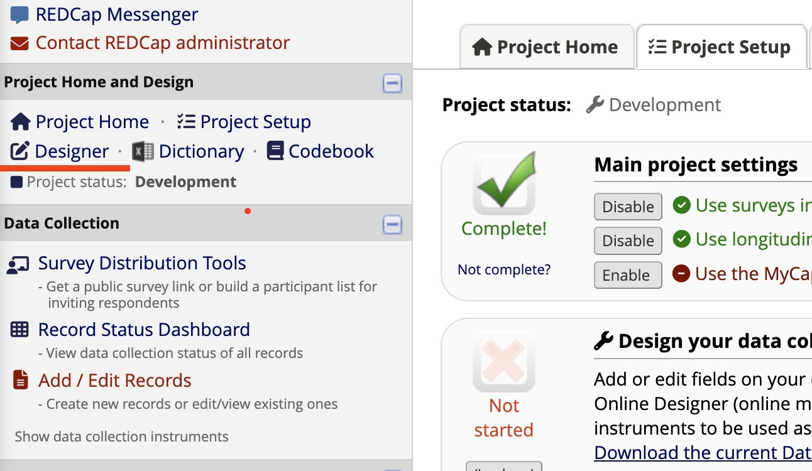
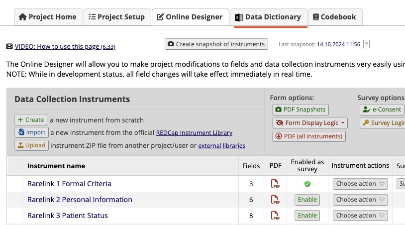

.. _3_1:

RareLink CDM Instruments
============================

.. attention::
   To use your local REDCap project, you will need to set up a local REDCap 
   instance. For this please contact your local REDCap administratior. A project
   name could for example be "RareLink - Your local REDCap location". 

To install the RareLink CDM instruments, you will need to download the 
instruments from the RareLink REDCap project.

.. tip:: 
  Read the :ref:`2_2` section to learn more about the RareLink CDM Instruments.  

1. **Download the instruments from the RareLink REDCap project.**

- :download:`Download RareLink CDM Data Dictionary v2.0.0 <../_static/res/rarelink_v2_0_0_datadictionary.csv>`
- :download:`Download all RareLink CDM instruments seperately as a .zip file <../_static/res/rarelink_cdm_single_instruments.zip>`

Via the RareLink CLI type:

.. code-block:: bash

  rarelink setup -sheets
_____________________________________________________________________________________

2. **Import the instruments into your REDCap project.**

- Go to your REDCap project.
- Click on the "Designer" tab on the left side of the screen.
- Click on the "Data Dictionary" tab on the top of the screen.
- Select the RareLink CDM Data Dictionary CSV file, or the separate instrument csv files.
- Click on the "Import" button.

.. tip:: 
  Read pages 25 & 26 of the `Comprehensive Guide to REDCap <https://www.unmc.edu/vcr/_documents/unmc_redcap_usage.pdf>`_ for more information. 

_____________________________________________________________________________________

3. **Verify that the instruments have been imported correctly.**

- Go to the "Online Designer" tab and check the data elements in each instrument.
- check with the :ref:`2_2` page to verify that
    - the instruments have been imported correctly.
    - the instruments are consistent with the RareLink CDM Data Dictionary.
    - the fields with BioPortal are connected properly.

.. tip:: 
  Read the :ref:`1_6` section to learn more about the general REDCap Setup, 
  among others how to connect BioPortal to REDCap.

_____________________________________________________________________________________

4. **Start capturing data with the RareLink CDM instruments.**

Check out the :ref:`4_1` section to learn more about manual data capture.

.. admonition:: Continue here...

    - Guide to develop the :ref:`3_2`
    - User guide for :ref:`4_1`

