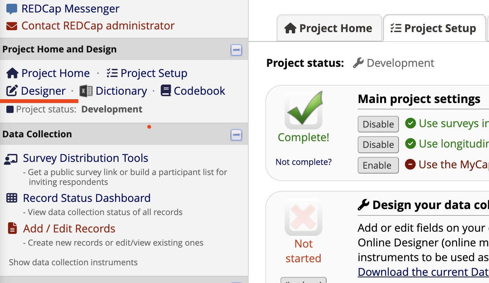
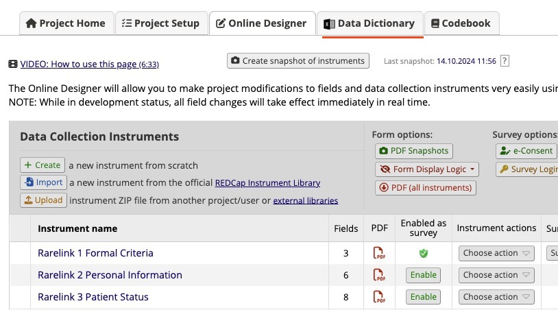
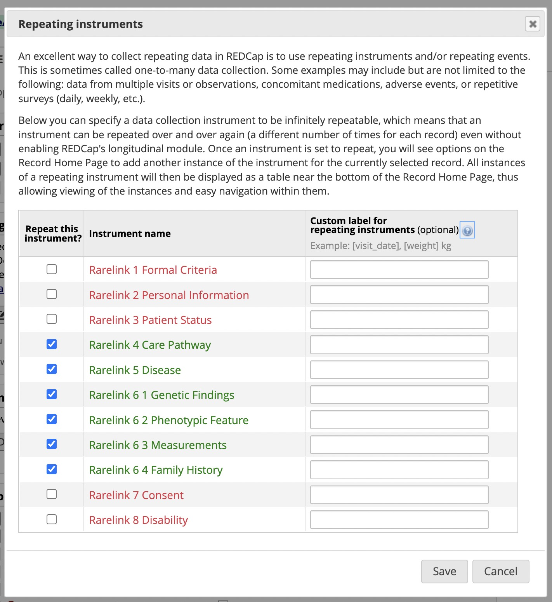

.. _3_3:

Set up the Data Dictionary
==========================

To install the RareLink-CDM instruments, you will need to download the 
instruments from here and follow the steps below. Make sure your REDCap project
is set up and running, otherwise follow the :ref:`3_2` section to set up a 
REDCap project. Read the :ref:`2_2` section to learn more about the RareLink CDM
Instruments. In case you have any questions, please contact your local REDCap 
administrator, or :ref:`12` us. 

Installation
-------------

_____________________________________________________________________________________

1. **Download the instruments from the RareLink REDCap project.**

- :download:`Download RareLink CDM Data Dictionary v2.0.0 <../../res/rarelink_cdm_datadictionary - v2_0_0.csv>`

2. **Upload the data dictionary to your REDCap project**

To upload your data dictionary to your REDCap project automatically, type:

.. code-block:: console

    rarelink setup data-dictionary

Otherwise you can also import the instruments manually:

- Go to your REDCap project.
- Click on the "Designer" tab on the left side of the screen.

_____________________________________________________________________________________

- Click on the "Data Dictionary" tab on the top of the screen.

  
_____________________________________________________________________________________

- Select the RareLink CDM Data Dictionary CSV file, or the separate instrument csv files.
- Click on the "Import" button.

_____________________________________________________________________________________

3. **Verify that the instruments have been imported correctly.**

- Go to the "Online Designer" tab and check the data elements in each instrument.
- check with the :ref:`2_2` page to verify that
    - the instruments have been imported correctly.
    - the instruments are consistent with the RareLink CDM Data Dictionary.
    - the fields with BioPortal are connected properly.

_____________________________________________________________________________________  

4. **Activate the repeating instruments feature**

- Go to the ``Project Setup`` tab.
- Within the section Enable optional modules and customizations click 
  on the **`Enable` Repeating Instruments** checkbox.
- Enable repeating instruments for the following instruments: 

_____________________________________________________________________________________

5. **Start capturing data with the RareLink CDM instruments.**

Check out the :ref:`4_1` or the :ref:`4_2` section to learn more about the 
semi-automatic import of data.

_____________________________________________________________________________________ 

.. admonition:: Continue here...

    - :ref:`4_1` section to learn on how to use the RareLink CDM instruments.
    - :ref:`4_2` section to learn on how to import data from tabular databases.
    - :ref:`4_3` section to learn on how to export data to Phenopackets.
    - :ref:`4_3` section to learn on how to export data to FHIR.

.. admonition:: Further reading...

    - Read pages 25 & 26 of the `Comprehensive Guide to REDCap <https://www.unmc.edu/vcr/_documents/unmc_redcap_usage.pdf>`_ for more information. 
    - Read the :ref:`1_6` section to learn more about the general REDCap Setup, 
        among others how to connect BioPortal to REDCap.

Separate RareLink-CDM Instruments
----------------------------------

The :ref:`2_2` section provides an overview of the RareLink-CDM which is
based on the **ontology-based rare disease common data model** harmonising
international registries, FHIR, and Phenopackets (:ref:`1_5`). However, for many
use cases, it may be necessary to use only a subset of the instruments. 

For such cases, please note:

1. If you use the RareLink-CDM instruments, you will **not need to enter data 
   for all instruments** - many of these instruments can be left empty or deleted.
2. The RareLink-CDM instruments are designed to be used in a **modular way**, 
   so you can use only the instruments that are relevant to your study.
3. However, if an instrument is used in your study, it is important to fill 
   in all ``mandatory`` the fields in that instrument to ensure correct FHIR 
   and Phenopacket export. Please read:

   - Section :ref:`cdm-instruments-overview`
   - & :ref:`4_1` 
4. The sheets ``(1) Formal Criteria`` and ``(2) Personal Information`` **must**
   always be filled in to ensure correct FHIR and Phenopacket export!
5. Feel free to :ref:`12` us in case you have any questions or need help.

Extensional RareLink-CDM Instruments
------------------------------------

The :ref:`2_2` section provides an overview of the RareLink-CDM which is 
based on the **ontology-based rare disease common data model** (:ref:`1_5`). 
However, for many use cases, it is necessary to extend the data model with
additional fields or instruments. This can be done by following the
established RareLink guidelines given in the :ref:`4_5` section. Feel free to 
:ref:`12` us in case you have any questions or need help.

