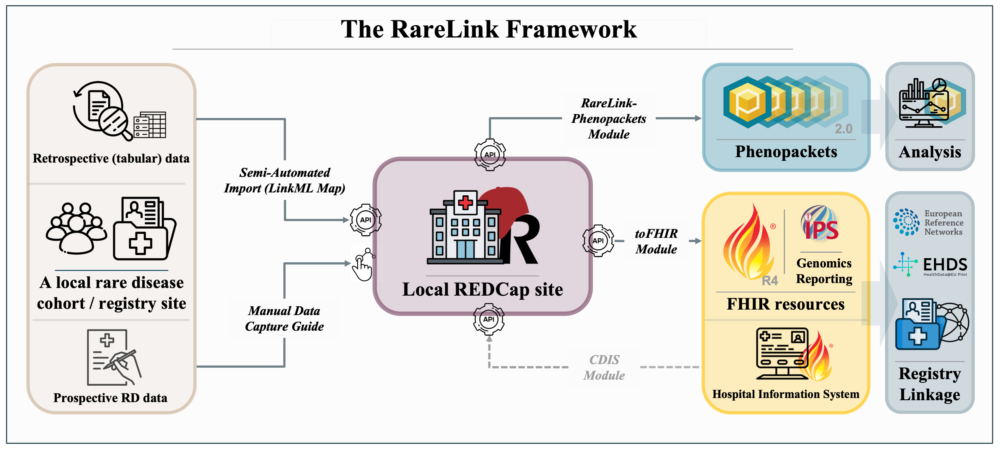

Welcome to the RareLink REDCap Documentation!
=============================================

.. image:: https://readthedocs.org/projects/rarelink/badge/?version=latest
    :target: https://rarelink.readthedocs.io/en/latest/?badge=latest
    :alt: Documentation Status

.. attention:: 
   RareLink v2.0.0.dev1 is under testing and development. Please :ref:`12` us 
   before using it to ensure you have the latest updates and guidance.

RareLink is a novel framework designed for managing and processing rare disease 
(RD) data within the REDCap. Rare diseases affect over 260 million individuals 
worldwide, yet data quality and scarcity pose significant challenges in research 
and clinical care. RareLink aims to standardize and streamline RD data management 
around REDCap by providing a structured project setup that ensures consistency 
across data collection instruments, variables, and data dictionaries. RareLink 
has integrated the `ontology-based rare disease common data model (RD-CDM) <https://github.com/BIH-CEI/rd-cdm>`_ 
into its core, allowing its linkage and preconifgured export to data the 
standards HL7 FHIR and the GA4GH Phenopacket Schema. In the following you will 
find detailed information on the RareLink framework, including its background, 
components, installation instructions, user guide, and full examples. 

________________________________________________________________________________

    Overview of the RareLink framework integrated with a local REDCap instance. 
    The framework comprises the RareLink instruments based on the RD-CDM, the 
    RareLink API, the toFHIR & CDIS module for export and import to HL7 FHIR IPS
    and Genomic Reporting Resources, and the RareLink-Phenopackets module for 
    direct export to GA4GH Phenopackets. Additionally, the LinkML-based import 
    mapper facilitates data import from tabular databases into REDCap, while 
    the Manual Data Capture Guide assists with the manual data capture of 
    RD-CDM data in a local REDCap project. Click `here <https://github.com/BIH-CEI/rarelink/blob/develop/docs/_static/res/rarelink_overview.svg>`_ 
    to see the figure in full size.

________________________________________________________________________________

.. note::
   - **GitHub Repository:** https://github.com/BIH-CEI/RareLink
   - The manuscript is currently being prepared for submission. A preprint
     will be available soon.

________________________________________________________________________________

________________________________________________________________________________
    

Sections
---------
1) :doc:`1_background/1_0_background_file`
    Introduction, definitions, and explanation of all the background information, 
    technologies, and systems used in the RareLink framework.

2) :doc:`2_rarelink_framework/2_0_rarelink_file`
    Overview and detailed information on the RareLink framework, its components,
    and architecture.

3) :doc:`3_installation/3_0_install_file`
    Installation guides for all components of the RareLink framework.

4) :doc:`4_user_guide/4_0_guide_file`
    User guides for all components of the RareLink framework.

5) :doc:`5_contributing`
6) :doc:`6_changelog`
7) :doc:`7_faq`
8) :doc:`8_glossary`
9) :doc:`9_acknowledgements`
10) :doc:`10_license`
11) :doc:`11_download_manifest`

________________________________________________________________________________

1) Background
---------------

- :doc:`1_background/1_0_background_file`
- :doc:`1_background/1_1_rd_interoperability`
- :doc:`1_background/1_2_ontologies`
- :doc:`1_background/1_3_ga4gh_phenopacket_schema`
- :doc:`1_background/1_4_hl7_fhir`
- :doc:`1_background/1_5_rd_cdm`
- :doc:`1_background/1_6_redcap`

________________________________________________________________________________

2) RareLink Framework
----------------------

- :doc:`2_rarelink_framework/2_1_rarelink_overview`
- :doc:`2_rarelink_framework/2_2_rarelink_cdm`
- :doc:`2_rarelink_framework/2_3_rarelink_cli`

________________________________________________________________________________

3) Installation
-----------------

- :doc:`3_installation/3_1_setup_rarelink_framework`
- :doc:`3_installation/3_2_setup_redcap_project`
- :doc:`3_installation/3_3_data_dictionary`
- :doc:`3_installation/3_4_redcap_api`

4) User Guide
--------------

- :doc:`4_user_guide/4_1_manual_data_capture`
- :doc:`4_user_guide/4_2_import_mapper`
- :doc:`4_user_guide/4_3_phenopackets`
- :doc:`4_user_guide/4_4_fhir_module`
- :doc:`4_user_guide/4_5_develop_redcap_instruments`
- :doc:`4_user_guide/4_6_redcap_tools`

________________________________________________________________________________

Additional Information
-----------------------
- :doc:`5_contributing`
- :doc:`6_changelog`
- :doc:`7_faq`
- :doc:`8_glossary`
- :doc:`9_acknowledgements`
- :doc:`10_license`
- :doc:`11_download_manifest`
- :doc:`12_contact`

________________________________________________________________________________

.. toctree::
   :caption: Background 
   :maxdepth: 2
   :hidden:

   1_background/1_1_rd_interoperability
   1_background/1_2_ontologies
   1_background/1_3_ga4gh_phenopacket_schema
   1_background/1_4_hl7_fhir
   1_background/1_5_rd_cdm
   1_background/1_6_redcap

.. toctree:: 
   :caption: RareLink Framework 
   :maxdepth: 2
   :hidden:

   2_rarelink_framework/2_1_rarelink_overview
   2_rarelink_framework/2_2_rarelink_cdm
   2_rarelink_framework/2_3_rarelink_cli

.. toctree::
   :caption: Installation
   :maxdepth: 2
   :hidden:

   3_installation/3_1_setup_rarelink_framework
   3_installation/3_2_setup_redcap_project
   3_installation/3_3_data_dictionary
   3_installation/3_4_redcap_api

.. toctree::
   :caption: User Guide
   :maxdepth: 2
   :hidden:

   4_user_guide/4_1_manual_data_capture
   4_user_guide/4_2_import_mapper
   4_user_guide/4_3_phenopackets
   4_user_guide/4_4_fhir_module
   4_user_guide/4_5_develop_redcap_instruments
   4_user_guide/4_6_redcap_tools

.. toctree::
   :caption: Additional Information
   :maxdepth: 2
   :hidden:

   5_contributing
   6_changelog
   7_faq
   8_glossary
   9_acknowledgements
   10_license
   11_download_manifest
   12_contact

Indices and tables
==================

* :ref:`genindex`
* :ref:`modindex`
* :ref:`search`

