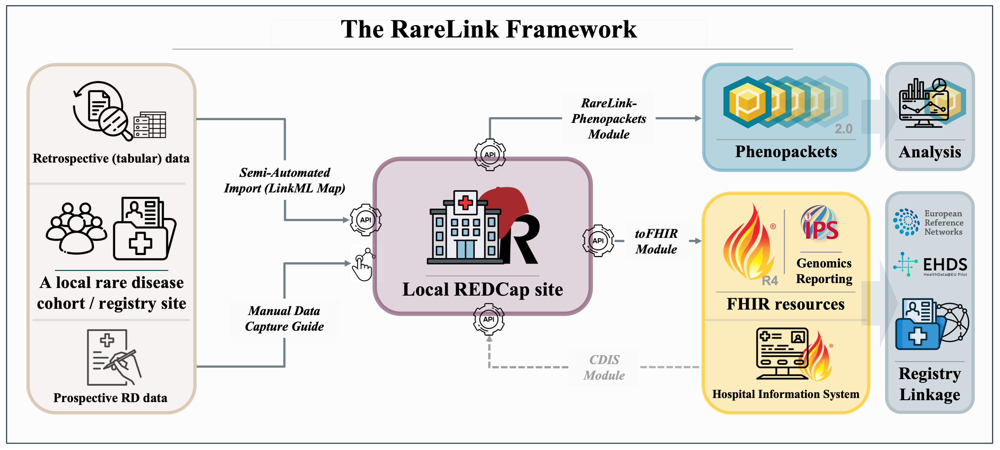

# Welcome to the RareLink Implementation Guide

Welcome to the RareLink Implementation Guide – a non-balloted extension of the [European Rare Disease Infrastructure Common Data Set (ERDRI-CDS)](https://eu-rd-platform.jrc.ec.europa.eu/set-of-common-data-elements_en). RareLink is a novel, open-source, and REDCap-based framework linking international registries to HL7 FHIR R4 and  GA4GH Phenopackets to enable rare disease data interoperability.

## Scope and Objectives

The RareLink project aims to:

- **Standardize** data capture for rare disease registries using REDCap forms preconfigured with ontology-driven instruments.  
- **Automate** transformation of REDCap records into interoperable formats (FHIR resources and Phenopacket JSON) for downstream analysis and data sharing.  
- **Extend** the ERDRI-CDS by defining a non-balloted RareLink Common Data Model (RareLink-CDM) with accompanying FHIR profiles and value sets.  
- **Facilitate** cross-registry research and clinical workflows by leveraging HL7 IPS and Genomics Reporting dependencies.  

Whether you are setting up a new registry, integrating with other data consumers, or performing federated analyses, RareLink streamlines the path from data entry to exchange.

## Background

The RareLink framework builds on the novel Rare Disease Common Data Model (RD-CDM) [https://doi.org/10.1038/s41597-025-04558-z](https://www.nature.com/articles/s41597-025-04558-z) harmonising the ERDRI-CDS with HL7 FHIR and GA4GH Phenopackets to enable standardized data exchange across registries and analysis tools.

## RareLink Software Architecture

RareLink consists of:
1. [The RareLink Documentation](https://rarelink.readthedocs.io/en/latest/index.html) centralising all components of the RareLink framework, installation and user guides, as well as background and additional information.
2. **The RareLink-CDM**: its corresponding REDCap data dictionary can be imported into any REDCap project with each instrument displaying a section within the RD-CDM for manuel data entry of [LinkML-based](https://linkml.io/) semi-automatic data capture. The profiles in this implementation guide represent the entire RareLink-CDM with all elements of the RD-CDM mapped to FHIR elements and can also be used for import via the [Clinical Data Interoperability Services](https://www.sciencedirect.com/science/article/pii/S1532046421002008).
3. **A command-line interface (CLI)** (`rarelink`) interacting with the API of a local REDCap for:
   - REDCap API authentication, setup, and framework settings
   - Interaction with REDCap to download or upload records or setup the data dictionary
   - Setup of a Hapi-server and directly exporting RareLink-CDM data to FHIR resources
   - Downloading of GA4GH Phenopackets

Further details on semi-automatic or manual data capture, FHIR import via CIDS, the CLI, the FHIR and Phenopackets module can be found in our [RareLink documentation](https://rarelink.readthedocs.io/en/latest/index.html).

> **Note:** The RareLink-CDM and its FHIR profiles are provided as a non-balloted extension of the [ERDRI-CDS](https://eu-rd-platform.jrc.ec.europa.eu/set-of-common-data-elements_en).

## FHIR Profiles & Dependencies

RareLink comse with 33 FHIR R4 StructureDefinitions covering:

- **HL7 International Patient Summary (IPS) v2.0.0**  
  Dependency: [IPS Implementation Guide](https://build.fhir.org/ig/HL7/fhir-ips/)  
- **HL7 Genomics Reporting v3.0.0**  
  Dependency: [Genomics Reporting IG](https://hl7.org/fhir/uv/genomics-reporting/STU3/index.html)  
- **RareLink-CDM Resource and Profile definitions**

__Figure 2: Schematic overview of the RareLink-CDM as both FHIR instances and a Phenopacket. FHIR resources are derived from the HL7 International Patient Summary v2.0.0 profiles for Patient, Condition, Laboratory, Radiology, and Procedure. Genetic findings are captured using the HL7 Genomics Reporting v3.0.0 Genetic Variant and Diagnostic Implication profiles. Additional components, including encounters, phenotypic and other observations (e.g. age category, gestational age), family history and consent (incorporating ERDRI-CDS elements), utilise FHIR R4 base resources. The RareLink-CDM Phenopacket comprises Individual, VitalStatus, and Disease blocks, together with phenotypic and measurement data, and genetic information within the Interpretation and VariantDescriptor blocks. ERDRI-CDS=European Rare Disease Infrastructure Common Data Set. HL7=Health Level 7. IPS=International Patient Summary. RareLink-CDM=RareLink Common Data Model.__

## Navigation

- **Scope and Objectives** – Project goals and deliverables  
- **Background** – RD-CDM theory and ERDRI-CDS  
- **Software Architecture** – Components and workflows  
- **RareLink-CDM** – Data dictionary and REDCap integration  
- **Profiles** – FHIR and Phenopacket definitions  
- **Implementation** – Installation, configuration, and examples  
- **Additional Info** – Contributing, changelog, FAQs  

---

**For questions or contributions, please see the **Additional Info** section or submit an issue on our [GitHub repository](https://github.com/BIH-CEI/RareLink).**
